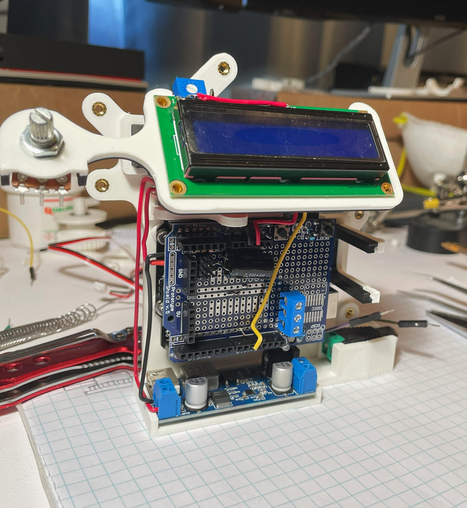
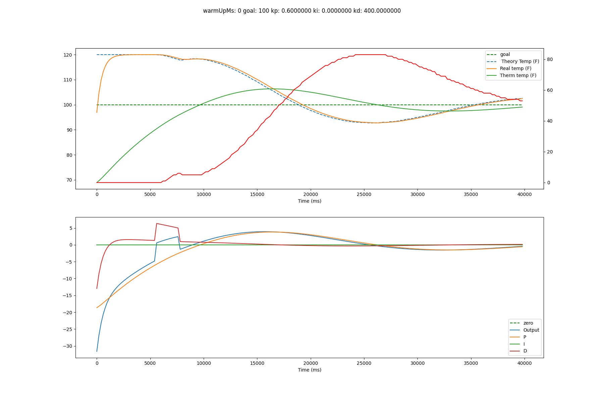
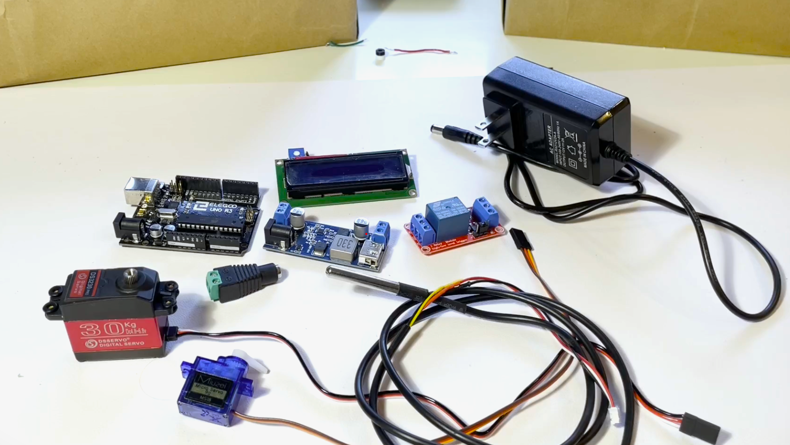

# Smart Faucet

## Video Summary

## How it Works

### The Code
The folder [temp_controller](./temp_controller/) has all the code that gets put onto the microcontroller. The main file [temp_controller.ino](./temp_controller/temp_controller.ino) has the implementation for the high level logic and PID controller. The hardware is abstracted into [hardware.cpp](./temp_controller/hardware.cpp), which contains all the logic for reading the thermometer value, updating the LCD screen, engaging the relay, and moving the motors. 

### Simulation / Testing
To debug/tune the PID controller, the code in [simulate_tests.cpp](./tests/simulate_tests.cpp) is designed to run on a PC, and runs the code in [temp_controller.ino](./temp_controller/temp_controller.ino) but mocks the hardware code. Each timestep, it saves the simulated tempurature values, faucet setting, and PID controller values to a CSV file. Then, [plotcsv.py](./tests/plotcsv.py) uses matplotlib to create and save plots from the CSV values. 

## Materials

- Arduino Uno Microcontroller (mine's Elgoo)
- Arduino Uno Prototyping Sheild
- LCD1602 screen
- 12v wall power supply
- 5.5mm power connector
- 12v to 5v buck converter
- 5v relay module
- DS18B20 waterproof tempurature probe
- 4.7k resistor (for thermometer module)
- switch (the master switch)
- 1000 uf capacitor (for servos)
- Sg90 Micro Servo
- 30kg Servo (probably could use lower strength, just depends on the faucet)

